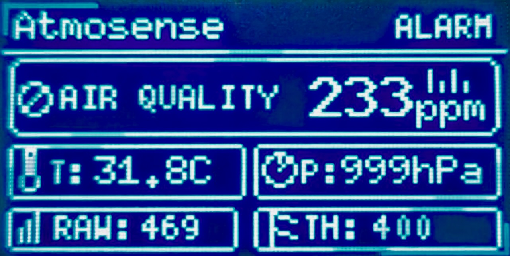
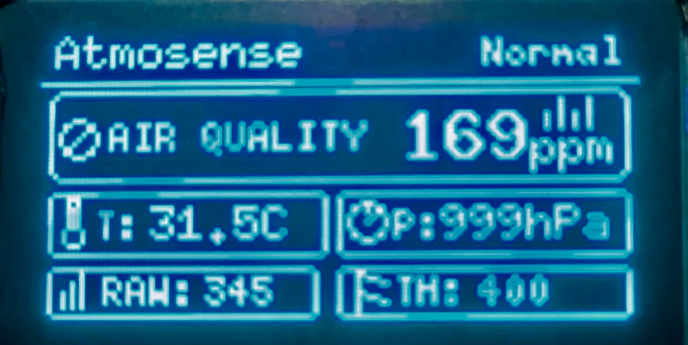

# 🌿 Atmosense – Smart Environmental Monitor

**Atmosense** is a compact, feature‑rich environmental monitoring system that tracks **air quality**, **temperature**, and **atmospheric pressure** in real time. It displays data on a crisp OLED screen, sounds an alarm when pollution rises, and uploads everything to the **Blynk cloud** so you can check conditions from anywhere.

  <table>
    <tr>
      <td align="center"><b>🚨 Alarm Active</b></td>
      <td align="center"><b>✅ Normal Air</b></td>
    </tr>
    <tr>
      <td></td>
      <td></td>
    </tr>
  </table>

## ✨ Features

| Category           | Details                                                                 |
|--------------------|-------------------------------------------------------------------------|
| 🌡️ **Sensors**      | BMP280 (temp + pressure), MQ‑135 (air quality / CO₂ equivalent)          |
| 📟 **Local Display** | 1.3" SH1106 OLED – smooth animations, icons, real‑time values            |
| 🔊 **Alerts**        | Active buzzer + red/green LEDs for visual/audible warnings               |
| ☁️ **Cloud**         | ESP8266 NodeMCU pushes data to **Blynk IoT** – view charts, history, set alerts |
| 🔋 **Power**         | Dual 18650 (4400 mAh) with TP4056 charger modules & 5 V boost converter  |
| 🎛️ **User Friendly** | Animated splash screen, dynamic status ("Normal" / "ALARM"), intuitive UI |

---

## 🧰 Hardware Components

| Qty | Component                         | Notes                                      |
|----:|-----------------------------------|--------------------------------------------|
| 1   | Arduino Uno R3                    | Main controller                            |
| 1   | ESP8266 NodeMCU                   | Wi‑Fi module for cloud connectivity        |
| 1   | 1.3" OLED Display (SH1106)        | I²C, 128×64 pixels                         |
| 1   | BMP280 Sensor                     | Temperature + pressure (I²C)               |
| 1   | MQ‑135 Gas Sensor                 | Air quality (analog output)                |
| 1   | Active Buzzer                     | 5 V, driven by PWM for louder sound        |
| 1   | Green LED + 220 Ω resistor        | Indicates normal air quality               |
| 1   | Red LED + 220 Ω resistor          | Indicates poor air quality                 |
| 2   | 18650 Li‑ion Battery (2200 mAh)   | Total 4400 mAh @ 3.7 V                     |
| 2   | TP4056 Charging Module            | One per cell for safe, independent charging|
| 1   | 5 V Boost Converter (e.g., MT3608)| Steps up battery voltage to stable 5 V     |
| 1   | USB‑C Female Extender             | Common charging port for both TP4056       |

---

## 🔌 Circuit Diagram

> 📌 **Place your schematic image here** – for example `docs/circuit_diagram.png`
(Insert your circuit diagram image – Fritzing, KiCad, or hand‑drawn)

text

### 🔗 Wiring Summary

**I²C Bus (shared)**
- OLED SDA → Arduino A4
- OLED SCL → Arduino A5
- BMP280 SDA → Arduino A4
- BMP280 SCL → Arduino A5

**Sensors & Actuators**
| Arduino Pin | Connected To           |
|-------------|------------------------|
| A0          | MQ‑135 analog output   |
| D7          | Buzzer (+)             |
| D8          | Green LED (via 220 Ω)  |
| D9          | Red LED (via 220 Ω)    |

**UNO ↔ NodeMCU (Serial)**
| UNO Pin | NodeMCU Pin         |
|---------|---------------------|
| D3 (TX) | RX (via voltage divider) |
| D2 (RX) | TX                  |
| GND     | GND                 |

> ⚠️ **Important**: Use a **voltage divider** (1kΩ + 2kΩ) between UNO TX (5 V) and NodeMCU RX (3.3 V).

**Power System**
- Two 18650 cells in **parallel** → 3.7 V, 4400 mAh
- Each cell has its **own TP4056** module
- Both TP4056 outputs connected together → **Boost Converter** input
- Boost Converter output (5 V) powers Arduino, OLED, and NodeMCU

---

## 💻 Software & Libraries

### Arduino Uno
Install the following libraries via **Library Manager**:
- `U8g2` by oliver
- `Adafruit BMP280` by Adafruit
- `SoftwareSerial` (built‑in)

Upload the sketch `atmosense_uno.ino` to the Arduino.

### ESP8266 NodeMCU
- Install **Blynk** library (v1.1.0 or newer)
- Install **ESP8266WiFi** (built‑in with ESP8266 board package)

Upload `atmosense_esp8266.ino` after inserting your Blynk credentials.

---

## 📱 Blynk Cloud Setup

1. Create a **Blynk IoT** template named `Atmosense`.
2. Add the following **Datastreams** (Virtual Pins):

| Name          | Pin | Type     | Unit  | Min/Max       |
|---------------|-----|----------|-------|---------------|
| Temperature   | V0  | Double   | °C    | 0 – 50        |
| Pressure      | V1  | Double   | hPa   | 900 – 1100    |
| Air Quality   | V2  | Double   | ppm   | 0 – 1000      |
| Raw ADC       | V3  | Integer  | –     | 0 – 1023      |

3. Build your dashboard with **Gauges**, **Labels**, and a **Super Chart** for history.
4. Copy the **Template ID**, **Device Name**, and **Auth Token** into the ESP8266 code.

---
## 🚀 Getting Started
Follow these steps to get your Atmosense up and running in minutes.

1. Clone the Repository
bash
git clone https://github.com/yourusername/atmosense.git
cd atmosense
2. Wire the Hardware
Connect all components according to the Circuit Diagram above.
Pay special attention to the voltage divider between UNO and NodeMCU!

3. Upload the Code
Board	Sketch File	Instructions
Arduino Uno	arduino/atmosense_uno.ino	Open in Arduino IDE, install required libraries, select Uno board, upload.
NodeMCU	esp8266/atmosense_esp8266.ino	Open in Arduino IDE, insert your WiFi and Blynk credentials, upload.
4. Power It Up
Connect the 5 V boost converter output to the Arduino's 5 V pin.

Or use a USB cable for testing (Arduino only – NodeMCU needs separate power for cloud).

5. Watch the Magic
The OLED will display an animated splash screen, then switch to the live dashboard. Open the Blynk app on your phone and see your sensor data streaming in real‑time!

## 📸 Gallery

 <table> <tr> <td align="center"><b>✨ Splash Screen</b></td> <td align="center"><b>📊 Main Dashboard</b></td> <td align="center"><b>📱 Blynk App</b></td> </tr> <tr> <td></td> <td></td> <td></td> </tr> </table> 
<em>Add your own photos to the <code>docs/</code> folder – the placeholders above will update automatically.</em>
 

## 🔋 Battery Life Estimate

Your dual-18650 power system provides reliable portable operation.  
Here’s the runtime breakdown:

| Parameter | Value |
|----------|------|
| 🔋 Battery Capacity | 4400 mAh @ 3.7 V (16.3 Wh) |
| ⚡ Boost Efficiency | ~85% |
| 🔌 Usable Energy @ 5V | ~13.8 Wh (≈2768 mAh) |
| 📊 Average Current Draw | ~350 mA |
| ⏱️ Estimated Runtime | ~8 hours (full charge) |

💡 **Power-Saving Tip:**  
Enable deep sleep on the ESP8266 between transmissions to extend runtime to **15–20 hours**.

---

## 📜 License

This project is open-source and available under the **MIT License**.  
See the `LICENSE` file for full terms.

---

## 🙌 Acknowledgements

This project stands on the shoulders of amazing open-source work:

| Library / Tool | Used For | Link |
|---------------|--------|------|
| U8g2 | OLED graphics & animations | https://github.com/olikraus/u8g2 |
| Adafruit BMP280 | Temperature & pressure sensor | https://github.com/adafruit/Adafruit_BMP280_Library |
| Blynk | Cloud connectivity & dashboard | https://blynk.io |
| Arduino & ESP8266 Core | Platform support | https://arduino.cc · https://esp8266.com |

---

✨ Thank you for checking out **Atmosense!** ✨
